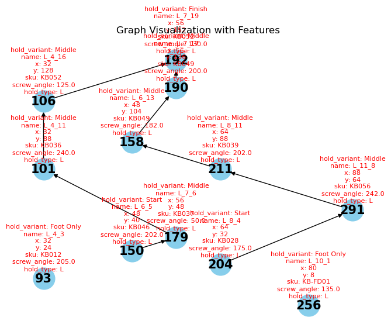
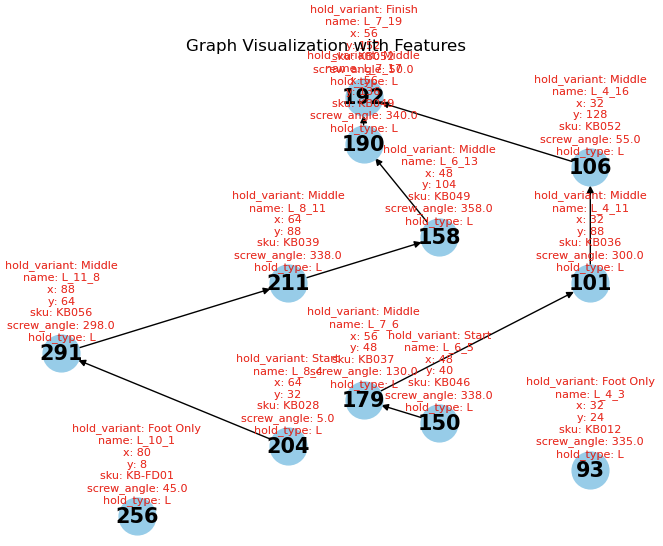

# KilterBot

Use some emulator for android i.e. [Geny Cloud](https://cloud.geny.io/).
Login and pull the database of Kilter app via `kilterproblems/Login.ps1` (Login is needed as only than the db is visible)  

## Example Climb 

## Hold Distributions Depending on Difficulty

## Generating Graphs out of Beta Videos of the Climbs 
Using motion tracking with mediapipe in `climber.py` and save landmarks in `data/specific_landmarks_sequence.json`  
  
comparing them to the static landmarks of the holds `data/holds.json` gives the squence information

## Mapping Landmarks to Kilterholds 
  

## Graph Visualizations
Different approaches of constructing graphs are tested.   
1. Simply connecting the nearest neighbors  
  
2. Using landmark detection matching the path of the hands directly relating hand moves to edges of the graph  
   

## Synthetic Data 
Eventhough this climb doesnt exist, we will mirror every climb as the difficulty would remain the same and we have more data for our model 

### GNN Training Results  
run `mlflow ui` 
